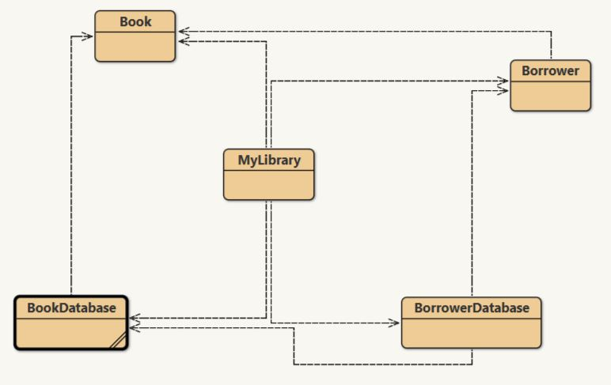

# MyLibrary-in-java

Developed a text interface  which simulates a small virtual library of electronic books. It is programmed in a complete object-oriented style of programming with a list of borrowers and books. Read and write operations are performed and used appropriate java collection classes to store and retrieve the data.

**Program Logic**

1.	Reading/writing data from/to text files 
2.	Using appropriate classes to represent the various objects in the program 
3.	Using appropriate Java Collection class or classes to store data 
4.	Using code to manipulate the data in the collection(s) 
5.	Performing simple searches, filtered by some given criteria 
6.	Using program constructs such as repetitions & selections 

**Information about the working of virtual library**

1. Only borrowers who are more than 18 years old are allowed to borrow books with an “Adult” rating. 
2. Use appropriate Java data structures to store the Borrower and Book objects, assume that the input data files are always in the correct formats.
3. All operations must be applied to the in-memory data, or data structures - there must not be constant reading/writing to/from the data file, except once at the start (when the program loads all data from the file) and once at the end (when the program saves all data back to the file, when it exits) 
4. The program must not crash when accepting user inputs, regardless of what the user enters. 

**Text file Explaination**

This project contains two file:
1. books.txt (Contains details of all books currently available in the system )
2. Borrowers.txt (Contains details of all borrowers currently stored in the system )

**1. books.txt**

Each line represents a single “book”. The fields are separated by commas. Each “book” takes up 3 fields. Note that the colouring shown above are for illustration only. 
You may assume: 
- The strings which represent the Borrower/Book fields (name/title/author/etc) do not contains commas (ie. a name like "Andrew, Smith" will not be possible). 
- This program does not provide the functionality to edit the book list (ie. use a text editor to edit "books.txt" if you wish to modify the book list). 
- This program does not provide the functionality to edit/remove a borrower once registered (ie. use a text editor to edit "borrowers.txt" if you wish to modify the borrower list). 

**2. Borrowers.txt**

The first input data file (borrowers.txt) has the following format for each line: 
- name,ID,age,title1,author1,rating1,title2,author2,rating2 
Example the following sample data file contains 3 borrowers:
> 	
-	David Smith,1,19,Book of Java,John Wilson,General,ABC of Life,Arnold S,Adult 
-	John Li,2,22,ABC of Life,Arnold S,Adult,Network Security,Jeremy Hacker,Adult 
-	Sue Dally,3,55,How to use a Computer,David Noidea,General 
Each line represents a single “borrower”. The fields are separated by commas. Each “book” takes up 3 fields. Note that the colouring shown above are for illustration only. 

### Class Diagram

 

## Program Explaination

This consist of three main classes:
1.	MyLibrary
2.	Borrower
3.	Book

**1. MyLibrary.java**

Maintains a list (using a Java Collection class) of Borrower objects of each Borrower object represents a person who can "borrow" books from the virtual library the list does not have a fixed size. Maintains a list (using a Java Collection class) of Book objects each Book represents a book which can be borrowed by a Borrower object each virtual book can be borrowed by different borrowers at the same time the list does not have a fixed size 
	
**2. Borrower.java**

Borrower object remembers the following data: 
- name: a String, must not be blank, must be alphabetic, must not contain commas, should be unique 
- ID: an int must be unique, and between 1-100 (inclusive) 
- age: an int, must be > 5 and < 110 

**3. Book.java**

This consists of:
- booklist: a list of Book objects 
- author: a non-empty String, must not contain commas 
- rating: a non-empty String (valid values are “General” or “Adult”) 

#### Additional information:

Book has a rating (General/Adult), which limits its availability to a borrower based on his age 

- allows each borrower to borrow up to 2 books at any one time 
- lists the details of an existing borrower and the books he/she has currently borrowed 
- produces a report of all borrowers 
-  allows a borrower to borrow/return a book 
- loads a list of borrowers from a text file o a sample data file will be provided to you – your program must be able to read the data from this file, and write back to the same file 
- loads a list of books from a text file o a sample data file will be provided to you – your program must be able to read the data from this file 
- saves the list of current borrowers (with the borrowed books) to a text file 

